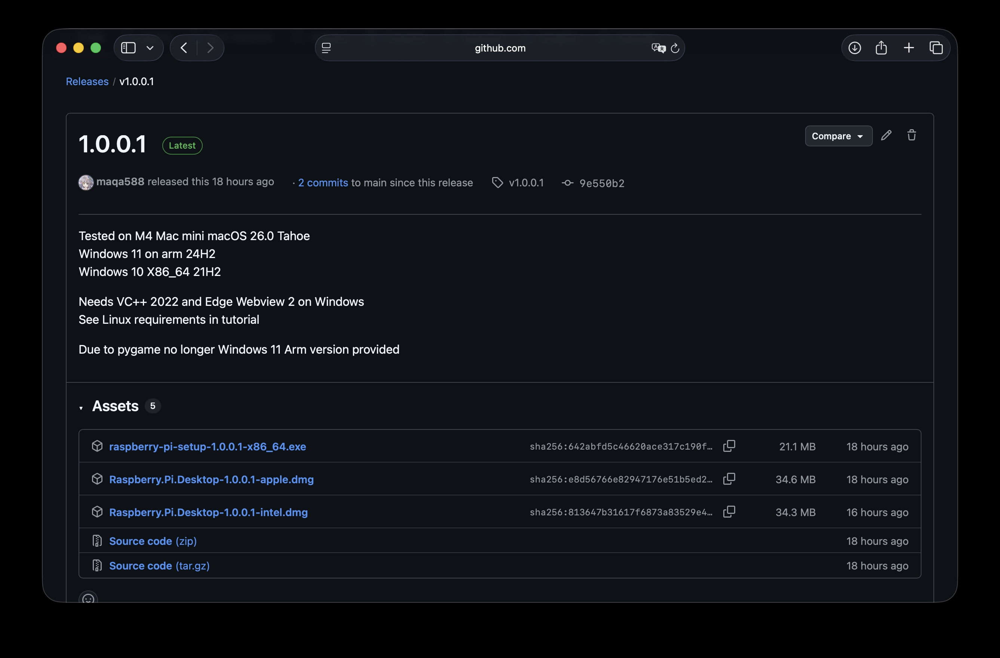
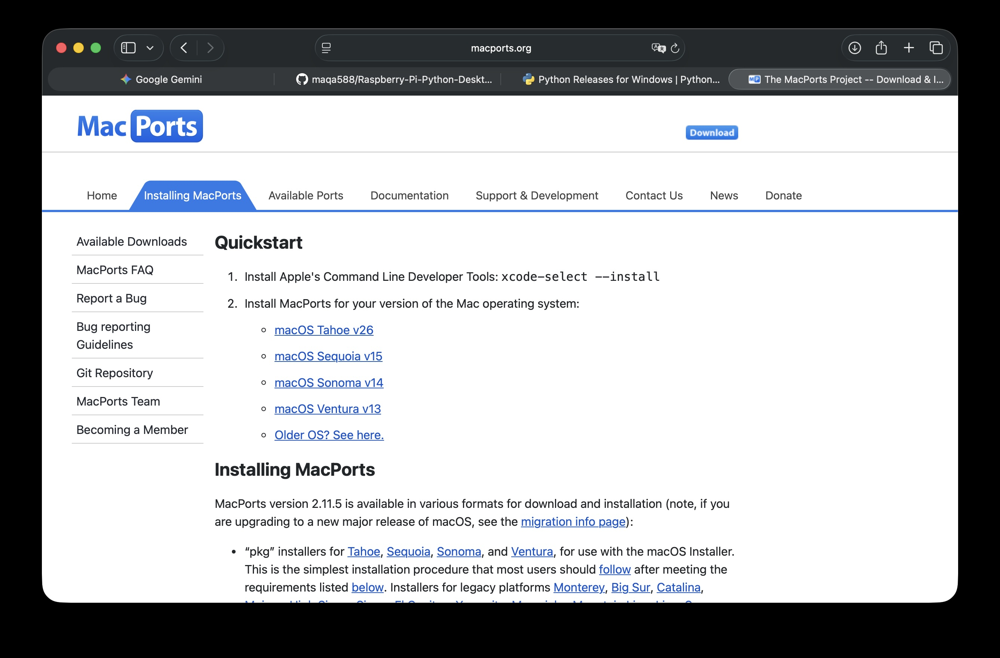

## macOS，Windows Linux 等 PC 客户端部署教程

### 前情提要

根据我的测试，本项目暂时不支持 Windows On Arm 的编译（主要原因是pygame），请在 **Windows X86 环境** 下编译。

如果你的 PC 设备是 **aarch64 架构的 Linux 设备**，则必须引入 **picamera2** 库才能运行（也就是说，你的单板计算机需要支持 SPI 摄像头，这样才能实现与树莓派上运行相同的效果）。

如果你的 PC 设备是 **Linux 非aarch64 架构的 Linux 设备**，您的UI布局和快捷键模式会和macOS，Windows不同，会更倾向于我向树莓派专门设计的布局。

---

### 直接运行

如果你想直接运行可执行文件，可以在项目页面的 **Releases** 中下载：



- macOS 用户下载 **dmg 格式文件**  
- Windows 用户下载 **exe 格式文件**

---

### 本地编译环境部署

#### Windows

在 Windows 上，请访问 [Python 官网](https://www.python.org/downloads/windows/) 下载最新的 Python，并使用 **系统权限安装**。  

你还需要安装 [Git for Windows](https://gitforwindows.org)。

将项目同步到你的本地文件夹：

```bash
git clone https://github.com/maqa588/Raspberry-Pi-Python-Desktop.git
```

创建虚拟环境并安装依赖：

```bash
python -m venv venv
source venv/bin/activate
pip install -r requirements.txt
```

运行程序：

```bash
python app.py
```

---

#### macOS

如果你尚未安装过包管理器，请根据你的系统版本下载 **MacPorts 包管理器**：



（如果你在中国大陆地区，默认镜像源可能因为网络问题速度较慢，可以在终端输入以下命令修改镜像源：  
`sudo nano /opt/local/etc/macports/archive_sites.conf`）

```

# 若要禁用默认的归档源，请取消注释以下占位配置；

# 它将会覆盖 ports tree 中的默认配置。

name macports\_archives
urls [https://mirrors.aliyun.com/macports/packages/](https://mirrors.aliyun.com/macports/packages/)
type tbz2

````

安装完成后，在终端输入：

```bash
sudo port selfupdate
````

更新完成后，输入以下命令安装 Python 3.13，并链接到本地终端：

```bash
sudo port install python313
sudo port select --set python python313
sudo port select --set python python313
```

接下来安装 **py313-pip**：

```bash
sudo port install py313-pip
```

并将其链接到本地终端：

```bash
sudo port select --set pip py313-pip
sudo port select --set pip py313-pip
```

（如果你在中国大陆地区，默认的 PyPI 源可能较慢，可以输入以下命令切换为清华源：

```bash
python -m pip install -i https://mirrors.tuna.tsinghua.edu.cn/pypi/web/simple --upgrade pip
pip config set global.index-url https://mirrors.tuna.tsinghua.edu.cn/pypi/web/simple
```

）

你还需要安装 **Tkinter**：

```bash
sudo port install py313-tkinter
```

最后，将项目同步到你的本地文件夹，创建虚拟环境并安装依赖：

```bash
python -m venv venv
source venv/bin/activate
pip install -r requirements.txt
```

运行程序：

```bash
python app.py
```

## Linux

目前暂时没有Linux打包的可执行文件，仅支持从源代码部署。

如果你的Linux机能紧张，像我的树莓派一样，你需要安装
```bash
sudo apt install libwebkit2gtk-4.1-dev libgstreamer1.0-dev libgstreamer-plugins-base1.0-dev
sudo apt install python3-wxgtk4.0 python3-wxgtk-media4.0 python3-wxgtk-webview4.0
sudo apt install python3-tk python3-pygame python3-requests python3-pil python3-chardet python3-psutil python3-pyinstaller python3-platformdirs python3-pil.imagetk
```

仅在树莓派上支持：
```bash
sudo apt install python3-picamera2
```
