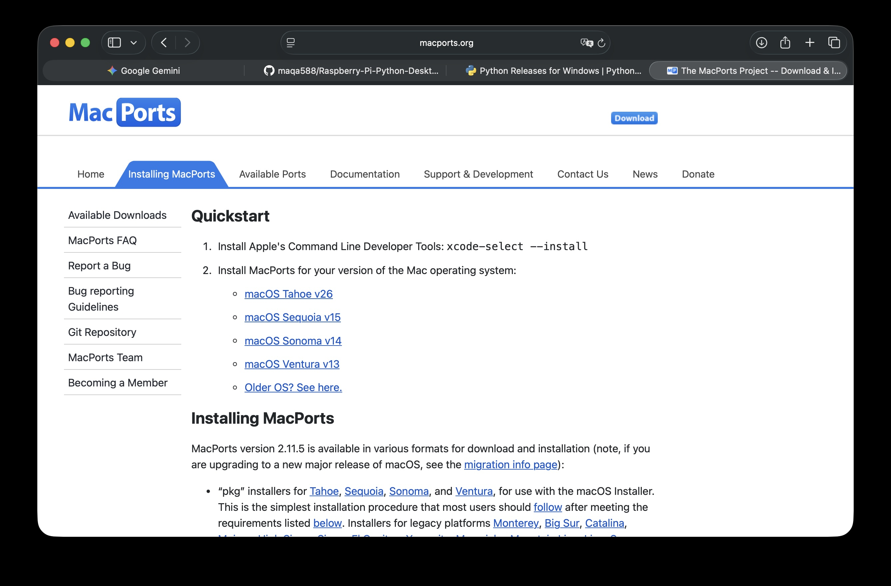

## macOS, Windows, Linux PC Client Deployment Guide

### Preface

Based on my testing, this project does **not** currently support compilation and execution on **Windows On Arm** (mainly because compiling Qt5 is quite complicated). Please run it under a **Windows X86 environment**.

If your PC device is an **aarch64 Linux device**, you must include the **picamera2** library to run it (in other words, your SBC needs to support an SPI camera, so that your device can achieve the same effect as running on a Raspberry Pi).

If your PC device is an **non aarch64 Linux device**, Your UI interface and shortcut logic will not be similar to the macOS and Windows but to the specific layout which designed for Raspberry Pi.

---

### Run Directly

If you just want to run the executable file, you can download it from the project’s **Releases** page:


- macOS users: download the **.dmg** file  
- Windows users: download the **.exe** file  

---

### Local Build Environment Setup

#### Windows

On Windows, visit the [official Python website](https://www.python.org/downloads/windows/) to download the latest version of Python, and install it with **administrator privileges**.  

You also need to install [Git for Windows](https://gitforwindows.org).

---

#### macOS

If you have not installed a package manager before, download the **MacPorts package manager** for your system version:



(If you are located in mainland China, the default mirror may be slow due to network issues. You can configure a faster mirror by editing:  
`sudo nano /opt/local/etc/macports/archive_sites.conf`)

```

# To disable the default archive source, uncomment the following dummy

# entry; it will shadow the one from the ports tree.

name macports\_archives
urls [https://mirrors.aliyun.com/macports/packages/](https://mirrors.aliyun.com/macports/packages/)
type tbz2

````

After installation, update MacPorts in the terminal:

```bash
sudo port selfupdate
````

Once updated, install Python 3.13 and link it to the local terminal:

```bash
sudo port install python313
sudo port select --set python python313
sudo port select --set python python313
```

Next, install **py313-pip**:

```bash
sudo port install py313-pip
```

And link it to the terminal:

```bash
sudo port select --set pip py313-pip
sudo port select --set pip py313-pip
```

(If you are in mainland China, the default PyPI source may be slow. You can switch to the Tsinghua mirror with:

```bash
python -m pip install -i https://mirrors.tuna.tsinghua.edu.cn/pypi/web/simple --upgrade pip
pip config set global.index-url https://mirrors.tuna.tsinghua.edu.cn/pypi/web/simple
```

)

You also need to install **Tkinter**:

```bash
sudo port install py313-tkinter
```

Finally, sync the project to your local folder, create a virtual environment, and install dependencies:

```bash
python -m venv venv
source venv/bin/activate
pip install -r requirements.txt
```

Run the program:

```bash
python app.py
```
